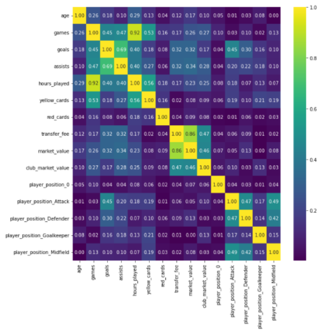
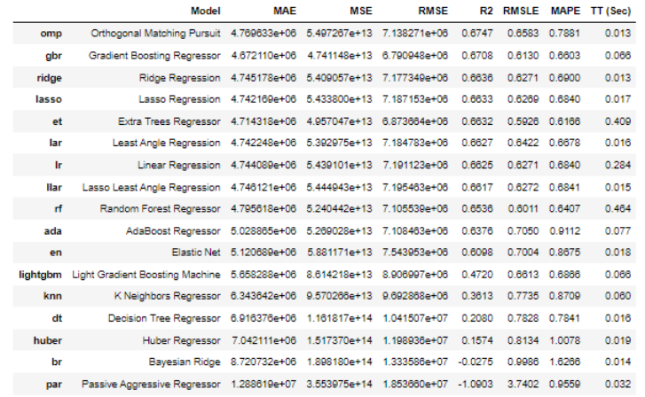
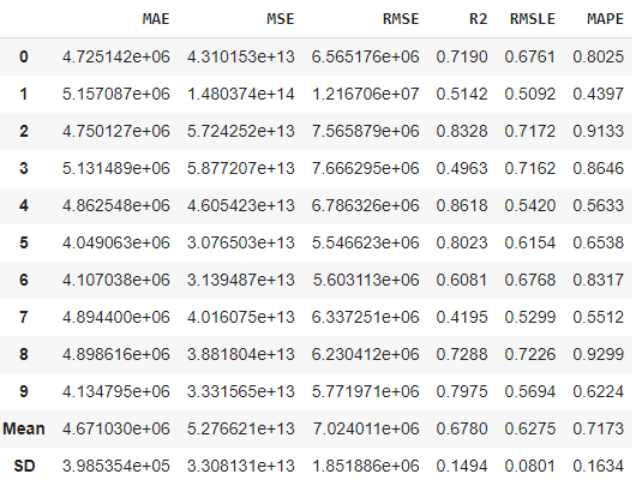
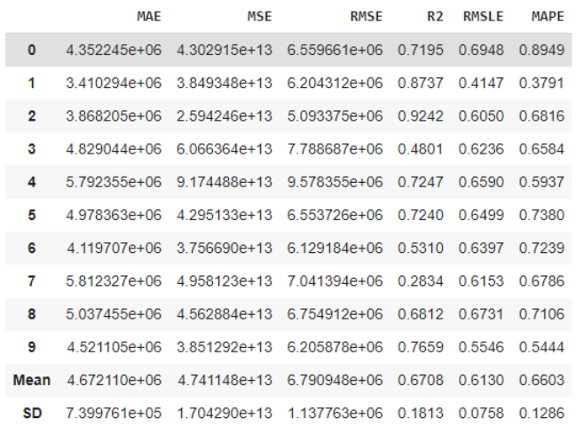
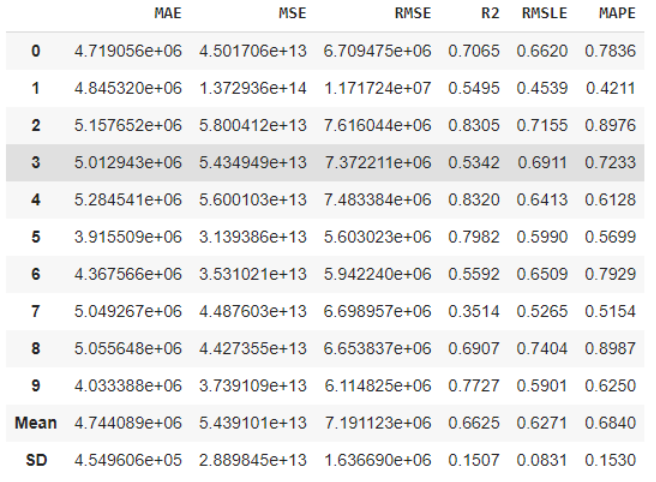
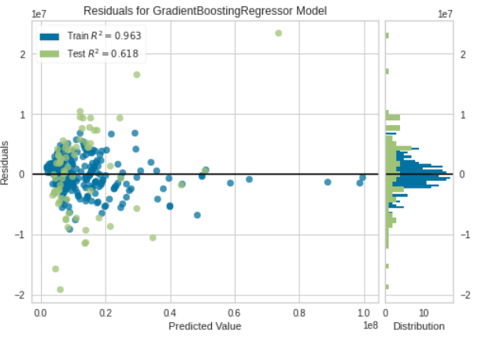
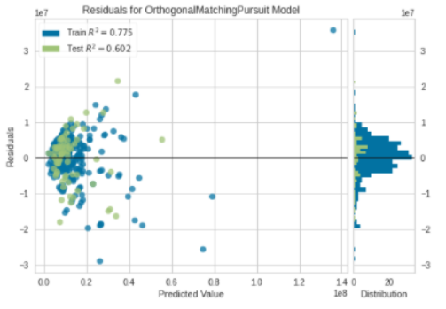
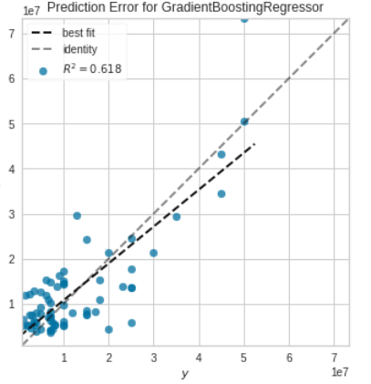
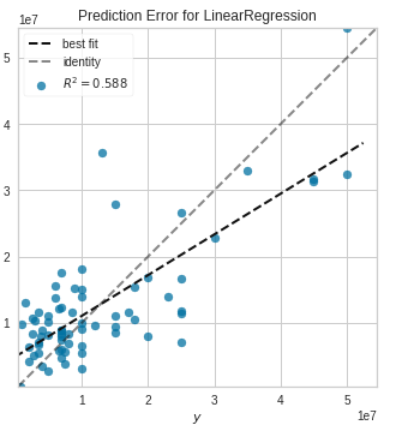
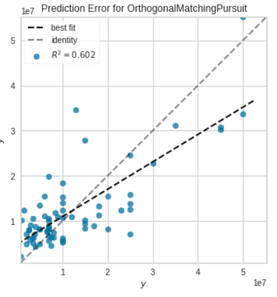

# Predicting-Football-soccer-using-a-Machine-Learning-Model
 Project Roadmap
 
 
 
 
#### Source:https://gfycat.com/compassionaterespectfulblesbok-soccer-world-cup-football-sports

In this Project, using multiple linear regression are being estimated market values of the football players in all European teams in the 2018-2019 season.Players from European League will be examined, and we will show the most and the least affecting factors for the market value.
# Link to Google Slides Presentation
[Presentation_Team3](https://docs.google.com/presentation/d/1ABp-GkqQUZYdRsoX6pAX-By1u8ZcKY6oNnCJunGCxJk/edit?usp=sharing)
# Link to Tableau Dashboard
- [Football_dashboard](https://public.tableau.com/views/Football_dashboard/PlayersperSeason?:language=es-ES&:display_count=n&:origin=viz_share_link)
- [Web_PageDashboard](https://sites.google.com/view/team3bootcamp/dashboard)
# The reason why we selected this topic?

Nowadays, FIFA is the most important association that governs football federations all over the planet and attracts a lot of fans. Because of its popularity, many football associations obtain huge incomes. Thus, soccer clubs are companies. These companies always make important decisions in relation to who football player they want to employ. It has been a fact that transfers of players make a significant impact on football clubs, cities, countries, and governments. Also, the market value of players provides a budget for these transfers. Therefore, the market value of a player is important to sales and profit for the clubs, which pay attention to analysis and predict player value. So, our question is “ what kind of factors will influence the market value of a player?”

# Questions We hope to answer with the data

- what kind of factors will influence the market value of a player?
- How much does the market value of the players increase on average? 
- player performance and club rank can make a significant impact on player value.

# Hypothesis
Player personal information, player performance and club maket value can make a
significant impact on player value.

# Project Objective & Target Audience

Develop an optimal model using Linear regression to predict the performance of the players.

- Target Audience
  * Sports statistics fans
  * Enthusiasts of football

# Data

- Data Source.

2021 Football Data clean, structured and automatically updated football data from from transfermarkt

Source:https://www.kaggle.com/davidcariboo/player-scores?select=players.csv

2018 Summer window transfer.The dataset of top 250 most expensive football transfers from season 2000-2001 until 2018-2019.

Source:https://www.kaggle.com/vardan95ghazaryan/top-250-football-transfers-from-2000-to-2018

- Data Anlysis

 This dataset aims to present up-to-date football data down to the level of performance of the players.
 
 We selected 10 independent variables and one dependent variable of the season 2018 to 2019. The independent variables are divided into three categories: physical data of the players, performance data of the players, and the ranking of the players club.

# Potential Features and Target Variable

* Appearnece 
* Goals
* Assists
* Minute played
* Date of birth
* Position

# Database
In order to obtain our target values for our model, we needed to join multiple datasets with information from the players club, games and player market values, we joined our datasets in SQL as shown in our ERD below to:

  

After joining the datasets we obtained a table with <code>19,189</code> rows containing the player name with multiple appearances and games. In order to reduce the amount of rows we obtained the performance of each player by performing the next operations:
* <code>COUNT</code> the number of <code>games</code>
* <code>SUM</code> the number of <code>goals</code>
* <code>SUM</code> the number of <code>assists</code>
* <code>SUM</code> the number of <code>minutes_played</code> and transform them into <code>hours_played</code>
* <code>SUM</code> of <code>yellow_cards</code>
* <code>SUM</code> of <code>red_cards</code>

After obtaining the performance of each player in all games of every season from 2014 to 2018, we obtained a database of 710 unique players from all the available seasons.
In order to load the data to the cloud to make it more available and easier to access we created connected our final database from PostgreSQL with Heroku as shown in the images below:

Heroku Connection    |  Database Credentials  
:-------------------------:|:-------------------------:
    | 

By loading the data into our Heroku database we can access the data by using the credentials of the database including the password. The database can be filtered by an SQL query as shown in the code below:

          from getpass import getpass
          password = getpass('Enter database password')

          connection = psycopg2.connect(user="azcaqpdjrciaow",
                                                password=password,
                                                host="ec2-34-226-18-183.compute-1.amazonaws.com",
                                                port="5432",
                                                database="d7m85rf8c5rhv5")
          cursor = connection.cursor()
          postgreSQL_select_Query = "select * from player_market_values where season = 2018 or season = 2017"

          cursor.execute(postgreSQL_select_Query)
          print("Loading data from Heroku")

          data = cursor.fetchall()
          df = pd.DataFrame(data, columns=['player_id', 'player_name', 'age', 'club_id', \
                                                                  'team_from', 'league_from', 'team_to', 'country_of_birth', \
                                                                  'country_of_citizenship', 'player_position', 'games', 'goals', \
                                                                  'assists', 'hours_played', 'yellow_cards', 'red_cards', 'transfer_fee', \
                                                                  'market_value', 'club_market_value', 'season'])
          Football_df = df.drop(columns=['player_id', 'player_name', 'club_id', 'team_from', 'league_from', 'team_to', 'country_of_birth', 'country_of_citizenship', 'season'])
          Football_df
              
The database is filtered by the most recent seasons <code>2017</code> and <code>2018</code> and the next columns are mantained:
* age
* player_position
* games
* goals
* assists
* hours_played
* yellow_cards
* red_cards
* transfer_fee
* market_value
* club_market_value
* season

# Machine Learning Model

We used a multiple linear regression analysis because the multiple regression model not only helps us to make predictions about the data but also can help us to identify the variables that have a significant effect on the dependent variable (market_value). So it was suitable as well as reasonable for us to use here.

Source: https://github.com/Edgarhv/Predicting-Football-soccer-using-a-Machine-Learning-Model/blob/db3a093e1ffb48e24f918146f414501d6cdadba9/FutPlayers_PredictValue.ipynb
### First Analysis

-We can see that R-squared is equal to 0.691, which means that the regression equation can explain the 69.1% variation in player value.
 
 
 
### Second Analysis
After defining the variables that we were going to use in our model we needed to encode categorical variables in our data. We used <code>One Hot Encoder</code> from sklearn to encode the <code>player_position</code> variable, obtaininga number per position of a player as shown below:
* <code>Attack</code> as **1000** and there are  <code>124</code> players with this position.
* <code>Defender</code> as **0100** and there are  <code>106</code> players with this position.
* <code>Goalkeeper</code> as **0010** and there are  <code>101</code> players with this position.
* <code>Midfield</code> as **0001** and there are only  <code>17</code> players with this position.

Following this process we created a correlation map in order to determine which variables have a higher impact in our target value (market_value).

  

The variables related with player's market values are:
* transfer_fee
* club_market_value
* assists
* goals
* games
* hours_played

Afterwards we used <code>PyCaret</code> to test our data with multiple regression model and compare their performances as shown in the image below:

  

As we can see, the highest ranked model is the Orthogonal Matching Pursuit regression model that has a mean **R2** of <code>0.6747</code>, a **RMSLE** of <code>0.6583</code> and a **MAPE** of <code>0.7881</code> and then we tuned this model in order to have a higher performance as shown below_

  

Obtaining a model with an **R2** ranging from <code>0.4195</code> to <code>0.8618</code>

Other models where tested and compared, below we have the tables of the <code>Gradient Boosting Regressor</code> and <code>Linear Regression</code> models.

Gradient Boosting Regressor    |  Linear Regression 
:-------------------------:|:-------------------------:
    | 

### Residuals Plots
Gradient Boosting Regressor    |  Linear Regression   |  Orthogonal Matching Pursuit
:-------------------------:|:-------------------------:|:-------------------------:
    |  | 

### Error Plots
Gradient Boosting Regressor    |  Linear Regression   |  Orthogonal Matching Pursuit
:-------------------------:|:-------------------------:|:-------------------------:
    |  | 

# Role Distribution

This week, each team member chose a shape, and We knew that each shape was responsible for a specific task. Also, We chose from the square, circle, triangle, and X.  Finally, We chose a figure concerning our strengths and with the help of the documentation on canvas.

We created a page where we can edit code all together at the same time and this is how we started to work. Also, with the help of other technologies such as WhatsApp we have and create good communication. 
https://deepnote.com/project/Untitled-Python-Project-eAGO52SQT5SsuFcbuPwvtw/%2FUntitled.ipynb

